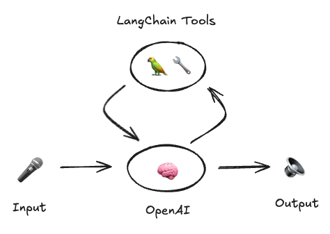

This is an implementation of a ReAct-style agent that uses OpenAI's new Realtime API.

Specifically, we enable this model to call tools by providing it a list of LangChain tools. It is easy to write custom tools, and you can easily pass these to the model.

